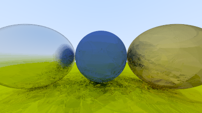
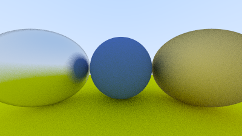

# rayfuck

A ray tracer written in Brainfuck, made by compiling Ray Tracing in One Weekend's C code into Brainfuck using a simple IR.

Brainfuck render:

compared to the C render:

The accompanying blog can be found [here](http://epestr.com/blog/writing-a-ray-tracer-in-brainfuck). 
